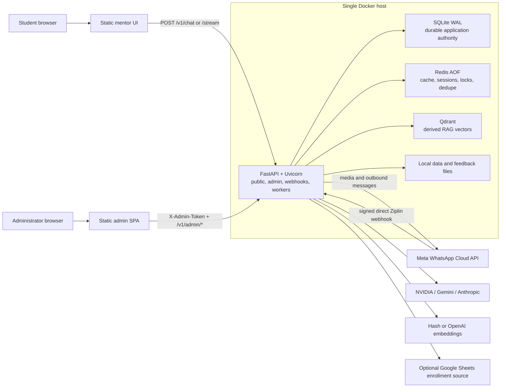
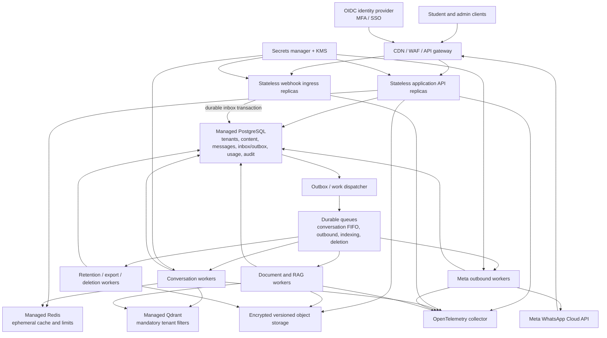

# Current Architecture and SaaS Hardening Plan

- **Review date:** 2026-09-05
- **Scope:** The repository and the locally running Docker deployment
- **Audience:** Engineering, operations, security, and product owners

This document describes what NorthStar actually runs today, how its web and
Ziplin WhatsApp paths move data, where state is owned, and what must change to
support a secure multi-tenant SaaS product. It intentionally separates three
things:

- **Current architecture:** behavior implemented in this repository.
- **Deployment snapshot:** environment-dependent facts observed on the review
  date. These facts can become stale.
- **Target architecture:** recommended work, not behavior that exists today.

Secrets, access tokens, personal phone numbers, and Meta account identifiers
are deliberately omitted.

## Executive summary

NorthStar is currently a hardened **single-host modular monolith**. One
FastAPI/Uvicorn process serves the public mentor UI, admin dashboard, chat APIs,
WhatsApp ingress, enrollment administration, training control plane, and two
background supervisors. SQLite is the durable application authority, Qdrant is
a derived vector index, Redis holds cache/session/deduplication state, and
several local files remain authoritative.

The design is stronger than a prototype in several important ways: direct Meta
webhooks can be signature-checked; Ziplin Phone Number ID isolation is enforced
twice; inbound payloads are durably queued with leases, retries, recovery, and
dead-letter state; training publishes revisioned vectors safely; runtime config
writes are versioned and atomic; uploads and feedback are bounded; and the API
container is substantially hardened.

It is **not yet a SaaS backend**. The most important blockers are:

1. There is no tenant boundary in SQLite, Redis, Qdrant, local files, provider
   credentials, or runtime configuration.
2. Public web chat has no authenticated student identity and trusts a
   caller-provided `student_id`, course, mode, and level.
3. All administrators share one static token; there are no identities, roles,
   MFA, tenant memberships, or attributable audit records.
4. SQLite, Excel, JSON/JSONL, and local media make the deployment single-node.
5. Training and webhook workers run inside the API process; process-local locks
   and tasks do not safely scale across replicas.
6. WhatsApp messages now have a protected conversation read model and delivery
   status ledger, but there is no transactional outbox; a crash at the wrong
   boundary can still duplicate or partially send a reply.
7. There are no tenant quotas, cost ceilings, distributed traces, production
   metrics, formal SLOs, automated restore drills, or complete privacy lifecycle.

The recommended next state is **not an immediate microservice rewrite**. Keep
the existing module boundaries, move durable state to PostgreSQL and object
storage, establish OIDC/RBAC and tenant context, then deploy webhook,
conversation, outbound, and indexing work as independent queue consumers. Split
business domains into separate services only when ownership or scaling evidence
justifies it.

## 1. Current system context

### Architectural style

- **Application shape:** modular monolith deployed as one API process.
- **Execution model:** asynchronous FastAPI handlers plus two in-process
  supervisors.
- **Durability model:** SQLite-backed leases for work, Redis for ephemeral state,
  Qdrant for derived vectors, and local files for selected authorities.
- **Consistency model:** strong local SQLite transactions where implemented;
  eventual consistency between SQLite and Qdrant, and between inbound handling
  and Meta outbound delivery.
- **Tenant model:** none. The whole deployment is one trust and data domain.

## 2. Runtime and deployment topology

The local production shape is defined by [`docker-compose.yml`](../docker-compose.yml)
and [`Dockerfile`](../Dockerfile).

| Component | Current responsibility | Persistence and exposure | Scale characteristic |
| --- | --- | --- | --- |
| `api` | Public UI, admin SPA, APIs, webhook ingress, mentor orchestration, training and webhook supervisors | Host port 8000 bound to loopback; `./data`, named `/app/state`, read-only secrets | One Uvicorn process; not safely horizontally scalable |
| `qdrant` | Vector retrieval for published knowledge revisions | Named volume; host port bound to loopback | One node; derived data but no HA |
| `redis` | Cache, conversation state, repeat state, locks, and message dedupe | AOF named volume; host port bound to loopback | One node; failures degrade some safeguards open |
| `public-tunnel` | Temporary Cloudflare quick tunnel | Optional `tunnel` profile | Test-only, transient hostname and no reliable production identity |
| `named-tunnel` | Stable remotely managed Cloudflare tunnel | Optional `permanent-tunnel` profile and secret token | Correct production direction, but not configured in the reviewed deployment |

### Container controls already present

The API runs as a non-root user with a read-only root filesystem, a constrained
`/tmp`, dropped Linux capabilities, and `no-new-privileges`. The secrets mount is
read-only. Uvicorn access logging is disabled so the webhook verification token
in a GET query cannot leak through ordinary access logs. These controls should
be preserved in every future deployment role.

### Deployment limitations

- API port 8000 is bound to host loopback. The configured Cloudflare tunnel is
  therefore the intended external edge, but there is no additional gateway or
  WAF policy represented in the repository.
- All containers share one default bridge network. Redis and Qdrant have no
  service authentication or TLS inside Compose.
- The Cloudflare image is pinned and direct tunnel traffic uses HTTP/2 for the
  locally observed network path.
- Qdrant and tunnel services do not have meaningful Compose health checks.
- There is no load balancer, rolling/canary deployment controller, autoscaler,
  infrastructure-as-code stack, or automated backup/restore job.
- Local writable volumes mean a second host would not see the same complete
  state.

## 3. Backend module ownership

The main code is in [`backend/app`](../backend/app). The current boundaries are
useful and can become application/service boundaries later.

| Module | Current responsibility |
| --- | --- |
| `main.py` | Application lifecycle, static mounts, security headers, public/chat endpoints, webhook ingress, outbound admin sends, enrollment APIs, compatibility ingestion |
| `admin_api.py` | Dashboard APIs for overview, WhatsApp state, audit, analytics, approved answers, knowledge, training, feedback, model checks, preview, and safe runtime config |
| `admin_store.py` | SQLite schema and durable authority for documents, revisions, jobs, webhook events, WhatsApp conversations/messages, feedback, approved answers, usage, and audit |
| `training.py` | Job scheduling, lease recovery, chunk/embed/index/publish pipeline, and interrupted-delete reconciliation |
| `webhook_queue.py` | Durable inbound event claiming, heartbeat, retries, recovery, ordering, and dead-letter transitions |
| `whatsapp.py` | Meta parsing, enrollment lookup, course/mode state machine, image handling, feedback, mentor calls, and Graph API sends |
| `mentor.py` | Exact approved answers, course policy checks, RAG, generation, output guard, repeat behavior, and clarification |
| `llm.py` | Primary/fallback text-provider orchestration |
| `nvidia.py`, `gemini.py`, `claude.py` | Provider-specific clients; Gemini also handles image question extraction |
| `embeddings.py` | Deterministic local hash embeddings or OpenAI embeddings |
| `vector_store.py` | Qdrant validation, deterministic revision points, indexing, and filtered retrieval |
| `cache.py` | Redis-backed cache, sessions, repeat state, locks, and dedupe |
| `config.py` | Environment settings plus allowlisted, versioned, atomically replaced runtime JSON |
| `question_history.py` | Append-only generated-answer history in a local text/JSONL file |
| `documents.py`, `chunking.py` | Document extraction and deterministic overlapping chunks |
| `auth.py` | One deployment-wide `X-Admin-Token` check |
| `schemas.py` | Pydantic request and response contracts |

## 4. API surface and trust boundaries

### Public and system routes

| Route group | Purpose | Current authentication |
| --- | --- | --- |
| `GET /` and static assets | Public mentor UI | None |
| `GET /health`, `/live`, `/ready` | Configuration, process, and dependency health | None |
| `GET /v1/public/config` | Safe UI configuration | None |
| `POST /v1/chat`, `/v1/chat/stream` | Mentor question and SSE-shaped response | None |
| `GET/POST /v1/whatsapp/ziplin/webhook` | Preferred direct Ziplin Meta callback | Verify token for GET; Meta HMAC for POST |
| `GET/POST /v1/whatsapp/webhook` | Served compatibility alias; not accepted as the production callback configuration | Same verification as the dedicated route |
| `POST /v1/whatsapp/ziplin/relay` | Legacy test/development compatibility; disabled in production | Private token when explicitly configured |
| `POST /v1/whatsapp/relay` | Generic legacy test/development compatibility; disabled in production | Private token when explicitly configured |

The public chat contract is an important current risk: the server accepts the
`student_id`, course, mode, and level sent by the caller. The bundled frontend
uses a fixed demo student value. There is no login, enrollment verification,
tenant resolution, request quota, or model-cost limit on this path.

### Protected admin routes

The admin API includes:

- system overview, analytics, and audit;
- WhatsApp readiness and the messaging kill switch;
- read-only, searchable WhatsApp conversation and message history;
- outbound menu/template sends and enrollment CRUD/import;
- approved-answer CRUD and publication;
- knowledge document CRUD/upload and training create/read/retry;
- feedback review, status update, and protected attachment download;
- model tests and WhatsApp-formatted previews;
- read/update of allowlisted runtime configuration.

Every route shares the same static bearer-style `X-Admin-Token`. The browser
keeps the token in tab-scoped `sessionStorage`, which avoids durable browser
storage but does not create an administrator identity or role boundary. Audit
events cannot reliably answer *which human* performed an action.

## 5. Current data architecture

| Store | Data owned today | Authority level | Main limitation |
| --- | --- | --- | --- |
| SQLite WAL in `/app/state` | Knowledge source and versions, published revisions, training jobs/leases, webhook queue, WhatsApp conversations/messages, feedback/sessions, approved answers, usage, audit | Primary durable application authority | Explicitly single-node; no tenant dimension or managed HA/PITR |
| Qdrant | Embedded chunks for published source revisions | Derived and rebuildable | One collection/deployment, no `tenant_id`, one node |
| Redis AOF | Answer cache, course/mode sessions, repetition/clarification state, processing locks, message dedupe, fallback enrollments | Ephemeral operational state | Global keyspace; selected helpers fail open on outage |
| `runtime-config.json` | Allowlisted runtime controls and editable mentor prompt | Local file authority | Per-host, deployment-global configuration |
| `question_answers.txt` | Append-only generated answer history | Local file authority | Linear scan, indefinite growth/retention, possible question PII |
| `feedback-media/` | Feedback screenshots | Local file authority | Single-host, no object versioning, scanning, or independent encryption policy |
| Excel workbook | Enrollment authority when configured | Primary in that mode | File concurrency and horizontal-scale limitations |
| Google Sheet | Highest-priority enrollment authority when configured | Primary in that mode | External spreadsheet is serving as live authorization data |
| `.env` and secrets mount | Provider and infrastructure credentials | Configuration authority | No managed rotation, per-tenant secret versioning, or access audit |

SQLite controls which document revisions are visible. Qdrant therefore remains
derived: a vector is only eligible when its course, embedding fingerprint, and
published source revision match the SQLite authority.

## 6. Detailed request and data flows

### 6.1 Web mentor question

1. The static UI fetches `/v1/public/config` and posts the selected course,
   mode, level, question, and demo student identifier.
2. FastAPI creates a request-scoped `MentorService` and records usage outcome
   and latency to SQLite.
3. A published exact-match approved answer, when present, wins immediately.
4. Otherwise a policy model classifies whether the question belongs to the
   active course. The check fails closed.
5. The question is embedded. Qdrant search is filtered by course, embedding
   fingerprint, and SQLite-published revisions.
6. Retrieved context is score-filtered. Despite its name, `strict_grounding`
   does not require a retrieved source; an allowed in-course question can still
   be answered from model knowledge.
7. The primary text model generates the answer. The configured fallback is used
   if the primary fails before producing output.
8. A second policy call evaluates the full output and fails closed if unsafe or
   out of course.
9. Repeat stage is maintained in Redis. Repeated questions become more detailed,
   then deeper, and the fourth repetition requests clarification.
10. Stage-one generated answers are appended to local question history.
11. `/v1/chat/stream` validates the complete response first and then emits it
    word by word. It is SSE transport, but not true upstream token streaming.

A normal uncached answer can therefore require three sequential model calls:
classification, generation, and output guard. This improves policy control but
must be measured and budgeted for latency and cost.

### 6.2 Knowledge upload and publication

```mermaid
flowchart LR
    Upload["Admin upload or edit"] --> Parse["Extract TXT / MD / PDF / DOCX"]
    Parse --> Draft["SQLite document draft"]
    Draft --> Job["SQLite training job"]
    Job --> Claim["In-process worker claims lease"]
    Claim --> Chunk["Clean and chunk"]
    Chunk --> Embed["Embed in batches"]
    Embed --> Stage["Stage deterministic Qdrant revision"]
    Stage --> Publish["Publish revision in SQLite transaction"]
    Publish --> Prune["Best-effort prune old vectors"]
```

Training is serialized by a process-local lock. SQLite lease tokens prevent a
stale worker from publishing after its lease is lost, and the supervisor
recovers expired leases and interrupted deletes. This is a sound single-node
publication pattern, but background execution is coupled to API process life.

### 6.3 WhatsApp ingress

The Ziplin production ownership model is direct Meta delivery:

1. Meta verifies the GET callback using the configured verify token.
2. POST bodies are streamed into a strict 2 MiB application limit and
   authenticated with Meta HMAC SHA-256 using the App Secret.
3. Every change in the signed batch must belong to the configured WABA and
   Ziplin Phone Number ID before any part of the payload is persisted.
4. A global messaging kill switch acknowledges and discards student messages
   while retaining delivery/read receipts so the protected inbox stays current.
5. Canonical payload JSON is hashed and inserted into the SQLite webhook inbox;
   duplicate payload hashes are acknowledged without creating another event.
6. The HTTP request returns after durable acceptance, while an in-process task
   attempts delivery.
7. A worker claims a lease, heartbeats it, and rechecks the Phone Number ID.
8. A process-wide lock serializes all webhook payload delivery to preserve local
   feedback-session ordering.
9. Redis adds message-level processing and completed markers.
10. Failures receive bounded backoff and retries, then move to dead-letter state.
11. The supervisor recovers due or abandoned events after restarts.

Legacy relay endpoints remain only for backward compatibility and are not part
of the configured Ziplin production path.

The SQLite inbox is a valuable foundation. At SaaS scale it must become a
tenant-scoped durable inbox plus brokered work, with ordering only per
conversation rather than globally.

### 6.4 CMA Teach, text, and image conversation

The requested open CMA behavior already exists in code:

- With open CMA access enabled, any inbound sender receives effective CMA
  access; this does not need an enrollment row.
- `Hi` or `menu` resets navigation and returns the applicable course/mode
  choices. CMA can default to Teach.
- A text question is sent through the same guarded `MentorService` used by web.
- An image is acknowledged, fetched from Meta, checked for type and size,
  transcribed into a question by Gemini vision, and then answered through the
  same mentor path.
- Replies are split at the configured WhatsApp character limit and sent in
  sequence through Meta Graph API.

This behavior can run only after a genuine inbound event reaches the direct
signed route. Application logic cannot compensate for a Meta callback that
still targets another service or for an unreachable temporary tunnel.

### 6.5 WhatsApp outbound and status events

Text, interactive, and template messages are sent directly to Meta Graph API.
Inbound and outbound messages are normalized into SQLite conversations; the
protected admin inbox exposes display-safe text, media indicators, and accepted,
sent, delivered, read, or failed state without returning full phone numbers or
Meta message IDs. There is still no transactional boundary connecting
completion of inbound work to creation of all outbound reply parts.

Consequently, if Meta accepts part of a reply and the process fails before the
inbound event is completed, replay may send a duplicate or repeat only part of
the response. The SaaS target needs a transactional outbox, one idempotent row
per reply part, provider message IDs, attempt history, and reconciliation.

### 6.6 Feedback flow

`FEEDBACK` starts a durable SQLite session before enrollment/course handling.
Text or a JPEG/PNG can then be persisted and acknowledged. Feedback creation is
idempotent by message ID; per-sender daily quota, individual size, total media
storage, magic-byte validation, and retention cleanup are present. Attachments
are not served publicly and are returned only through the protected admin API
with restrictive response headers.

The missing SaaS controls are object storage, malware/parser isolation, tenant
ownership, configurable retention, export/delete coverage, and encryption/key
governance.

## 7. Failure handling and reliability today

### Controls to retain

- Production startup validates required secrets and rejects several weak or
  contradictory configurations.
- Direct webhooks use HMAC; admin and legacy compatibility tokens use
  constant-time comparison.
- WABA and Phone Number ID are checked before queuing; Phone Number ID is
  checked again before message processing.
- Webhook and training work use durable leases and fencing tokens.
- Webhook retry, recovery, retention, and dead-letter states exist.
- Qdrant revision publication avoids exposing a partially indexed document.
- Runtime configuration writes use version checks and atomic file replacement.
- Image/upload size and type bounds reduce resource and parser exposure.
- The container has strong non-root and filesystem controls.

### Remaining failure modes

- API restart also stops both supervisors, even though their work survives in
  SQLite.
- Process-local locks do not coordinate replicas and one global webhook lock
  prevents parallel processing of unrelated senders.
- Redis failure preserves availability but weakens dedupe and session behavior.
- Message dedupe and raw-event retention are time-bounded; sufficiently old
  replayed events can be processed again.
- There is no outbound outbox, so inbound completion and reply delivery are not
  atomically connected.
- No automatic backup/restore system proves an RPO or RTO.
- `/ready` checks Redis, Qdrant, and SQLite, but not Meta, model providers,
  stable ingress, queue age, or token expiry.
- Logs are stdout/container-local. There are no correlated traces, production
  metrics, alert rules, or SLO dashboards.

## 8. Ziplin deployment snapshot

This subsection records the reviewed environment on 2026-09-04. Re-run the
diagnostics before relying on it operationally.

| Capability | Observed state | Meaning |
| --- | --- | --- |
| Local API | Healthy | Redis, Qdrant, and SQLite passed `/ready` |
| Meta outbound authorization | Validated, then marked for rotation | Permissions, phone association/status, and the approved starter template passed read-only checks, but the disclosed token must not be treated as production-ready |
| CMA/Teach code path | Implemented | Any sender can be admitted to CMA and text/image questions are supported |
| Current configured callback | Legacy third-party URL | The replacement build rejects this as a production Ziplin callback |
| Direct Meta path | Not operational yet | The reviewed deployment has no App Secret or permanent direct callback hostname |
| Cloudflare quick tunnel | Test-only | HTTP/2 connectivity works, but the generated hostname is transient |
| Named stable tunnel | Not configured | No stable base URL/tunnel instance was active |
| Inbound queue backlog | Empty at review time | This does not prove delivery; no recent genuine inbound reached the queue |

Therefore, local answering and outbound Meta access are working, but the full
Ziplin inbound path is not production-ready. The selected migration is to
publish a stable HTTPS NorthStar origin, store the Meta App Secret, register
`/v1/whatsapp/ziplin/webhook` directly on the Ziplin Meta app, and verify real
text, image, duplicate, restart, and status journeys. A relay is not an accepted
production alternative. Do not use a quick-tunnel hostname as the permanent
Meta callback.

Security action required before production: rotate the current Meta access token
because it has been disclosed outside the production secret store. Never write
the replacement into source, documentation, tickets, or chat; store it only in
an approved secret manager or protected deployment secret.

## 9. SaaS target principles

1. **Tenant context is server-resolved.** Resolve it from the authenticated
   identity, requested hostname, or registered WhatsApp Phone Number ID. Never
   trust a client-supplied `tenant_id`.
2. **Defense in depth for isolation.** Enforce tenant ownership in application
   repositories, PostgreSQL row-level security, vector filters, cache keys,
   object prefixes, queue messages, and audit records.
3. **Acknowledge first, process later.** Webhook ingress should authenticate,
   validate, durably insert, and return quickly. It must not wait for models.
4. **At-least-once plus idempotency.** Design for duplicate queue delivery and
   provider retries; do not claim impractical end-to-end exactly-once delivery.
5. **Durable data has one authority.** PostgreSQL owns business state; object
   storage owns files; Qdrant is derived; Redis is disposable.
6. **Separate deployment roles before services.** Stateless API, webhook ingress,
   conversation worker, outbound worker, and indexing worker may use the same
   codebase and release artifact initially.
7. **Usage and privacy are product data.** Metering, quotas, retention, export,
   deletion, and auditable consent are part of the core model.
8. **Reliability is measurable.** Operate against SLIs, SLOs, alerts, restore
   tests, and capacity tests rather than container-running status.

## 10. Recommended target architecture

### 10.1 Edge and control plane

- Use a stable managed HTTPS hostname, WAF, request/body limits, bot protection,
  and route-specific rate limits.
- Separate public webhook/chat routes from the administrative plane. Restrict
  `/admin`, `/docs`, `/openapi.json`, and detailed health output in production.
- Authenticate humans with OIDC. Require MFA through the identity provider and
  authorize every operation through tenant membership and role.
- Authenticate machine integrations with independently rotatable secrets or
  workload identity, not the human admin mechanism.

### 10.2 Application and workers

Initially keep one codebase and domain modules, but deploy independent roles:

| Role | Responsibility | Scaling signal |
| --- | --- | --- |
| Application API | Public authenticated chat and admin control plane | Request latency, CPU, concurrent requests |
| Webhook ingress | Verify, resolve tenant/channel, persist inbox event, acknowledge | Request rate and acknowledgement latency |
| Conversation worker | Order and execute one conversation turn, including model policy/RAG | Queue depth, oldest-event age, model concurrency |
| Outbound worker | Send each outbox part, retry safely, reconcile Meta status | Send rate, provider throttling, failure age |
| Indexing worker | Parse, scan, chunk, embed, publish, and rebuild vectors | Index queue depth, document size, embedding quota |
| Privacy worker | Retention, export, deletion, cache/vector cleanup | Deadline backlog and deletion SLA |

Use a queue partition key such as
`tenant_id + channel + external_sender_id` so one conversation stays ordered
while independent senders execute concurrently.

### 10.3 PostgreSQL as durable authority

Introduce managed PostgreSQL and controlled migrations such as Alembic. At
minimum, model:

- `tenants`, `users`, `memberships`, and `roles`;
- `students` and `channel_identities`;
- `plans`, `subscriptions`, and `entitlements`;
- `tenant_settings` and encrypted `provider_credentials` references;
- `courses` and canonical `enrollments`;
- `knowledge_documents`, `document_versions`, and `training_jobs`;
- `conversations`, `messages`, and model/prompt versions;
- `inbound_events` and durable processed-message identifiers;
- `outbound_messages` and `delivery_attempts`;
- `feedback` and object references;
- immutable `usage_ledger`, `cost_ledger`, and `audit_events`;
- `retention_policies` and `deletion_jobs`.

Every tenant-owned row must have a non-null `tenant_id`. PostgreSQL Row-Level
Security should default-deny access without valid tenant context, in addition to
normal application authorization. Service/database owner roles must be designed
carefully because privileged roles can bypass ordinary RLS.

Excel and Google Sheets should become controlled import/export connectors.
PostgreSQL should be the sole live enrollment authority.

### 10.4 Tenant boundary propagation

| Layer | Required tenant control |
| --- | --- |
| HTTP | Resolve tenant from verified JWT/host or registered Phone Number ID; reject ambiguity |
| Application | Immutable request context; repository methods require tenant context |
| PostgreSQL | Non-null `tenant_id`, foreign keys, RLS, and negative isolation tests |
| Queue | Include tenant and conversation partition key in every message |
| Qdrant | Put `tenant_id` on every point and require it in every query/delete filter |
| Redis | Prefix every key with environment and tenant; never use it as authority |
| Object storage | Tenant-scoped prefixes, signed URLs, encryption policy, and access logs |
| Providers | Credentials and budgets selected from server-side tenant/channel mapping |
| Observability | Tenant-safe tags; redact message bodies, phone numbers, secrets, and PII |
| Audit | Tenant, actor, role, request ID, source, outcome, and before/after summary |

For Qdrant, a shared collection with an indexed tenant payload is efficient for
many ordinary tenants. Dedicated shards or collections should be reserved for
large or regulated tenants that need stronger resource or isolation boundaries.

### 10.5 Transactional inbox and outbox

**Inbound:** insert the provider event and its unique key in the same PostgreSQL
transaction that records acceptance. A dispatcher publishes committed work to
the broker. Consumers are idempotent and can be retried.

**Outbound:** the conversation transaction creates the assistant message and one
outbox row per WhatsApp part. The outbound worker records an attempt, sends it,
and persists the provider message ID. Status webhooks update the same ledger.
Crash recovery resumes only parts that have not reached the required state.

Use uniqueness such as provider + tenant + channel + provider event/message ID,
not only a time-limited Redis marker. Retain identifiers for the documented
provider replay and business period.

### 10.6 Object and vector storage

- Store original documents, feedback media, exports, and quarantine objects in
  encrypted, versioned object storage.
- Use signed, short-lived object access and a malware/parser quarantine flow.
- Run complex document parsers away from the public API with CPU, memory, time,
  archive-depth, and decompression limits.
- Treat Qdrant as rebuildable. Include `tenant_id`, course, document/version,
  embedding fingerprint, and publication state in every point.
- Move from hash embeddings to a production semantic embedding model only after
  establishing per-course evaluation sets, cost limits, and versioned rebuilds.
- Consider reranking only when evaluation data shows it improves answer quality
  enough to justify latency and cost.

### 10.7 Identity, secrets, and security

- Replace the shared admin token with OIDC sessions/JWTs, tenant membership,
  least-privilege roles, and MFA.
- Never accept student identity or enrollment entitlement solely from the client.
- Store Meta, model, and database secrets in a managed secret service
  backed by KMS. Record versions and rotate without redeploying all tenants.
- Add tenant/user/IP rate limits, concurrency bulkheads, upload limits, message
  limits, and provider spend ceilings.
- Use private service networks and TLS/authentication for data services.
- Minimize/redact PII in logs, usage events, and raw payload retention.
- Add dependency and container scanning, SAST, secret scanning, SBOM generation,
  signed images, immutable image digests, and least-privilege workload identity.
- Test authorization at both function and object levels and test every tenant
  boundary with two independent identities.

### 10.8 Observability and SLOs

Instrument HTTP ingress, queue handoff, conversation processing, retrieval,
each model call, outbound attempts, and status callbacks with correlated request,
event, conversation, and trace IDs. Export structured redacted logs, metrics, and
traces through OpenTelemetry.

At minimum, alert on:

- webhook acknowledgement latency and authentication failures;
- inbound/outbound queue depth and oldest-event age;
- retries, dead-letter count, and safe replay failures;
- Meta send/status failures and credential/token expiry;
- model/provider latency, error rate, fallback use, token consumption, and cost;
- retrieval empty-rate, policy-block rate, and answer-quality evaluation drift;
- database saturation, replication/backup state, cache errors, and vector health;
- tenant quota rejection and abnormal spend.

Suggested launch objectives:

- webhook acknowledgement p99 under 1 second;
- ordinary API p95 under 300 ms, excluding model generation;
- monthly service availability at least 99.9%;
- no sustained queue backlog growth at agreed launch load;
- alerts for queue age, dead-letter, Meta send, and provider failure within
  5 minutes;
- database RPO at most 5 minutes and service RTO at most 60 minutes, proven by
  restore exercises.

These are starting targets, not promises; finalize them from product impact,
traffic, provider limits, and budget.

### 10.9 Metering, billing, and privacy

- Create append-only usage and cost ledger entries for model input/output,
  embeddings, media, messages, storage, and jobs.
- Enforce plan entitlements and quota atomically; add per-minute concurrency,
  daily/monthly consumption, and hard tenant/provider spend ceilings.
- Bill and reconcile from the ledger rather than mutable request counters.
- Define tenant-configurable retention, consent, export, correction, deletion,
  residency, and subprocessor policies with legal/privacy review for applicable
  jurisdictions.
- Deletion must cover PostgreSQL, objects, Qdrant, caches, queues, backups under
  retention policy, and external processors where supported.
- Send immutable audit/security events to a separate restricted sink or SIEM.

## 11. Prioritized risk register

| Priority | Risk | Impact | Required response |
| --- | --- | --- | --- |
| P0 | Disclosed Meta access token | Unauthorized API use until revoked/expired | Rotate now; store replacement only in managed secret storage |
| P0 | Ziplin has no stable inbound path | `Hi`, text, images, and statuses do not reach the bot reliably | Configure permanent HTTPS, the App Secret, and the direct signed Meta callback |
| P0 | Public unauthenticated model endpoint | Impersonation, cross-session interference, and unbounded spend | Authenticate/authorize or temporarily disable; add strict rate/cost limits |
| P0 | One shared admin token | No identity, revocation, MFA, or granular authorization | OIDC, MFA, memberships, and RBAC |
| P0 | No tested automated backup/restore | Permanent business-data loss | Encrypted backups, PITR target, runbook, and restore drill |
| P1 | No tenant ID anywhere | Cross-customer disclosure/corruption | PostgreSQL tenant model, RLS, mandatory tenant propagation and tests |
| P1 | Local authorities and SQLite | No HA or safe horizontal scale | PostgreSQL, object storage, controlled migrations |
| P1 | In-process workers and global lock | Deploy coupling, poor concurrency, replica races | Durable queues, independent workers, per-conversation partitioning |
| P1 | No transactional outbound outbox | Duplicate or partial WhatsApp replies despite the new delivery read model | Transactional outbox, durable attempts, and status reconciliation |
| P1 | No production telemetry/SLOs | Slow detection and uncertain reliability | OpenTelemetry, dashboards, alerts, synthetic journeys |
| P1 | Redis/Qdrant unauthenticated internally | Service compromise can expose or alter data | Private network plus TLS/auth and managed HA services |
| P1 | Missing privacy lifecycle | Compliance and trust risk | Retention, export/delete, PII redaction, processor governance |
| P2 | Hash embeddings and global revision filters | Retrieval quality and growth bottlenecks | Evaluated semantic embeddings and tenant-scoped publication metadata |
| P2 | No billing/quota ledger | Revenue leakage and noisy-neighbor cost | Immutable metering, entitlements, quotas, billing reconciliation |
| P2 | Manual delivery/security process | Unsafe releases and slow recovery | IaC, CI/CD gates, scanning, signed artifacts, canary rollback |

## 12. Migration roadmap and acceptance gates

### Phase 0: immediate containment and Ziplin production path

Work:

- Rotate the disclosed Meta credential and review adjacent secrets.
- Enable one stable inbound ownership model and run real-device tests for `Hi`,
  CMA/Teach selection, text questions, image questions, duplicates, restarts, and
  delivery/status callbacks.
- Put the API behind managed HTTPS/WAF and restrict admin/docs exposure.
- Authenticate or temporarily disable public web chat; apply temporary hard
  request, concurrency, and spend limits.
- Add structured redacted logs, request/event IDs, basic metrics, alerts, and
  inbound/outbound synthetic checks.
- Automate encrypted backups and complete one restore exercise.

Exit gate:

- No disclosed credential remains valid.
- Web chat is authenticated or disabled.
- Valid webhooks are durably acknowledged at p99 under 1 second.
- Queue age, dead-letter, Meta failure, and provider failure alert within
  5 minutes.
- A measured restore achieves temporary RPO at most 15 minutes and RTO at most
  2 hours.
- Repeated real-device `Hi`, text, and image tests pass through the chosen stable
  route without manual payload injection.

### Phase 1: tenant, identity, and data foundation

Work:

- Add PostgreSQL, Alembic migrations, repository interfaces, tenant entities,
  OIDC login, membership, and RBAC.
- Move configuration, documents, approved answers, feedback metadata, usage,
  audit, enrollments, and answer history from local authorities.
- Add tenant context to every PostgreSQL, Redis, Qdrant, object, provider, and
  queue operation.
- Enable default-deny RLS and build cross-tenant negative tests.

Exit gate:

- Every tenant-owned row and vector has a non-null `tenant_id`.
- RLS blocks a deliberately unfiltered repository query.
- Two-tenant tests cover every read and write API and return no foreign data.
- No admin endpoint accepts the shared static token.
- Every mutation audit records tenant, actor, role, request ID, timestamp,
  outcome, and before/after summary.

### Phase 2: durable asynchronous processing

Work:

- Replace API-lifespan supervisors with brokered, independent worker roles.
- Add durable inbox identifiers and a transactional outbound outbox.
- Partition conversation work by tenant/channel/sender.
- Add provider-aware timeouts, `Retry-After`, exponential backoff with jitter,
  circuit breakers, bulkheads, and concurrency budgets.
- Add safe dead-letter inspection and replay operations.

Exit gate:

- Killing API or worker processes at every processing boundary causes no lost
  logical reply and no duplicate completed reply.
- Multipart delivery resumes only unsent parts.
- Duplicate/reordered webhook tests remain correct during Redis loss.
- API and workers independently operate with at least three replicas.
- An authorized operator can inspect and safely replay a dead-letter event.

### Phase 3: object storage and RAG isolation

Work:

- Move source files and feedback media to encrypted, versioned object storage.
- Adopt managed multi-zone PostgreSQL, Redis, and Qdrant where appropriate.
- Make Redis fully disposable.
- Enforce tenant-aware vector access centrally and improve tenant-scoped revision
  publication.
- Add document quarantine/scanning, semantic embedding evaluation, and
  model/prompt/embedding version tracking.

Exit gate:

- API and worker containers make no persistent local writes.
- Cross-tenant vector tests return zero foreign points.
- Storage is encrypted in transit and at rest.
- Export and deletion cover relational, object, vector, and cache state within
  the documented period.
- Every supported course has a versioned evaluation set and quality threshold.

### Phase 4: SaaS commercial and governance controls

Work:

- Add immutable usage/cost ledgers, plans, entitlements, quotas, and billing.
- Add tenant retention, export/delete, consent, privacy, and audit evidence.
- Add enterprise SSO/SCIM or tenant-specific keys only when customer demand
  justifies them.

Exit gate:

- Usage reconciliation differs from provider bills by less than 1%.
- Tenant cost and gross margin are visible by provider, channel, and feature.
- Concurrent quota tests cannot overspend the configured ceiling.
- Automated secret/PII checks pass for logs and traces.
- Retention and deletion jobs produce auditable completion evidence.

### Phase 5: delivery and resilience

Work:

- Define infrastructure with Terraform or an equivalent system.
- Add CI gates for tests, type/lint checks, migrations, tenant isolation, SAST,
  dependency/image scanning, SBOM, signed images, and load tests.
- Deploy immutable image digests using rolling or canary releases.
- Add multi-zone scaling, PostgreSQL PITR, object versioning, and scheduled DR
  exercises.

Exit gate:

- Availability and latency objectives are met at agreed launch load without
  growing queue backlog.
- Database RPO and service RTO are proven through restore exercises.
- A deliberately failed canary rolls back automatically.
- Critical vulnerabilities and failed migrations cannot be promoted.

## 13. Recommended engineering sequence

The dependency order matters:

1. Fix stable Ziplin ingress, rotate secrets, and protect public spend.
2. Introduce identity and a server-resolved tenant context.
3. Move relational state to PostgreSQL and files to object storage.
4. Add inbox/outbox and independently deployed worker roles.
5. Make vector, cache, provider, audit, and object access tenant-safe.
6. Add metering, quotas, observability, restore evidence, and privacy workflows.
7. Scale replicas and managed data services.
8. Split modules into services only where team ownership, security isolation, or
   measured scaling pressure makes the operational cost worthwhile.

Avoid building many microservices before steps 1-6. That would distribute the
current missing identity, tenant, and transaction boundaries rather than solve
them.

## 14. SaaS launch definition of done

NorthStar should not be described as multi-tenant SaaS-ready until all of these
are demonstrably true:

- A tenant is resolved by trusted server-side identity/channel mapping.
- Every business row, vector, cache key, object, event, and audit is tenant-safe.
- Cross-tenant authorization tests run in CI and fail closed.
- Human admins use individual OIDC identities with MFA and roles.
- Public students are authenticated/authorized and cannot select unauthorized
  courses or forge another student identity.
- The API is stateless and horizontally replicated; durable jobs run in separate
  workers.
- Inbound and outbound processing is durable, idempotent, observable, and safely
  replayable.
- PostgreSQL, object storage, Redis, and vector storage have production HA,
  encryption, backups, and proven recovery appropriate to their authority.
- Quotas and hard spend limits prevent a tenant or attacker from exhausting
  shared provider capacity.
- Usage, cost, delivery, and audit ledgers reconcile and are attributable.
- Retention, export, deletion, and processor governance are implemented and
  reviewed for the markets served.
- SLO dashboards, paging alerts, synthetic WhatsApp journeys, load tests, and DR
  exercises provide operational evidence.
- Ziplin `Hi`, CMA/Teach, text, image, duplicate, restart, and status paths pass
  repeatable end-to-end tests through the permanent production ingress.

## 15. Evidence and external guidance

Repository evidence used for this review:

- [`backend/app/main.py`](../backend/app/main.py)
- [`backend/app/admin_api.py`](../backend/app/admin_api.py)
- [`backend/app/admin_store.py`](../backend/app/admin_store.py)
- [`backend/app/mentor.py`](../backend/app/mentor.py)
- [`backend/app/whatsapp.py`](../backend/app/whatsapp.py)
- [`backend/app/webhook_queue.py`](../backend/app/webhook_queue.py)
- [`backend/app/training.py`](../backend/app/training.py)
- [`backend/app/vector_store.py`](../backend/app/vector_store.py)
- [`backend/app/cache.py`](../backend/app/cache.py)
- [`backend/app/config.py`](../backend/app/config.py)
- [`docker-compose.yml`](../docker-compose.yml)
- [`Dockerfile`](../Dockerfile)

Primary external references supporting the target design:

- [PostgreSQL Row Security Policies](https://www.postgresql.org/docs/17/ddl-rowsecurity.html)
- [Qdrant multitenancy guidance](https://qdrant.tech/documentation/tutorials/multiple-partitions/)
- [AWS transactional outbox pattern](https://docs.aws.amazon.com/prescriptive-guidance/latest/cloud-design-patterns/transactional-outbox.html)
- [OpenTelemetry observability primer](https://opentelemetry.io/docs/concepts/observability-primer/)
- [OWASP API Security Top 10](https://owasp.org/www-project-api-security/)
- [OWASP API4: Unrestricted Resource Consumption](https://owasp.org/API-Security/editions/2023/en/0xa4-unrestricted-resource-consumption/)
- [Cloudflare remotely managed tunnel permissions](https://developers.cloudflare.com/cloudflare-one/networks/connectors/cloudflare-tunnel/configure-tunnels/remote-tunnel-permissions/)
